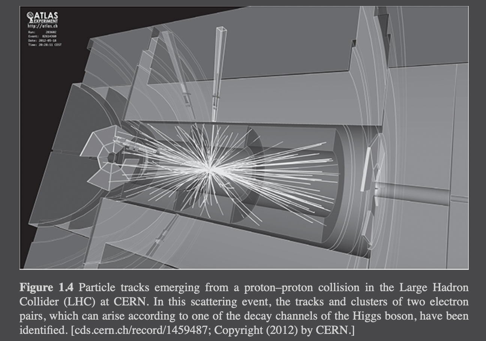

# 1 Approach to Quantum Field Theory

HCO clarifies the relationship b/w "fundamental particle physics" & "quantum field theory."
    The first chapter includes:
         1. several philosophical contemplations
         2. a discussion of mathematical & physical elements

The beauty of the entire approach is a fruit of the intimate relationship b/w QFT and philosophy. Knowledge of linear
algebra and quantum mechanics is required. Note that Khrennikov mentioned since quantum probabilities are based on linear
algebra, they are much simpler for the application of quantum simulation & quantum computation. This is the subject of  
more exciting topics in Quantum Measurement Problems, Carbon Capture, Mental Health, Quantum Brownian Motors, and
Quantum Gravity.
Section 1.1: Complex vector spaces, Hilbert space vectors, and density matrices for describing quantum systems, bosons 
and fermions, canonical commutation relations, Heisenberg's uncertainty relation, the Schrödinger and Heisenberg pictures
for the time evolution of quantum systems, and finally a basic idea of the measurement process.
Section 1.2: The basics of quantum mechanics
Section 1.1.3: The crucial construct of Fock spaces (loose way)
Section 1.2.1: Further elaboration of the Fock space (tight way)

## Content

1. [Philosophical Contemplations](#philosophical-contemplations)
   * [Images of Nature](#images-of-nature)
   * [Space and Time](#space-and-time)
   * [Infinity](#infinity)
   * [Irreversibility](#irreversibility)
        - [Autonomous Tume Evolution](#autonomous-time-evolution)
        - [Entropy](#entropy)
        - [Effective Field Theory](#effective-field-theory)
        - [Thermodynamics, Decoupling, and Reductionism](#thermodynamics-decoupling-and-reductionism)
        - [Arrow of Time](#arrow-of-time)
        - [Causality](#causality)
        - [Relation to Previous Work](#relation-to-previous-work)
   * [On the Measurement Problem](#on-the-measurement-problem)
   * [Approaches to Quantum Field Theory](#approaches-to-quantum-field-theory)
        - [Particles vs. Fields](#particles-vs-fields)
        - [Pragmatic Quantum Field Theory](#pragmatic-quantum-field-theory)
        - [Main Problems of Quantum Field Theory](#main-problems-of-quantum-field-theory)
        - [Rigorous Quantum Field Theory](#rigorous-quantum-field-theory)
        - [Dissipative Quantum Field Theory](#dissipative-quantum-field-theory)
2. [Mathematical and Physical Elements](#mathematical-and-physical-elements)
	* [Fock Space](#fock-space)

## Philosophical Contemplations

This Section includes the following topics:

- The methodology of science is based on the epistemological ideas of Ludwig Boltzmann. 
- The representation of space and time is considered in the light of Immanuel Kant's ideas.
- Infinity and irreversibility are discussed, and some contemporary philosophic considerations about quantum field theory are concluded.
- Note that HCO constantly considered Western philosophy as a source of inspiration for his work. We recommend a hybrid approach where Eastern philosophers such as Mulla Sadra's ideas play a crucial role.
- HCO chooses the conscious approach of Henry Margenau in metaphysical principles (that have an essential role in science). But wait! What are the unconscious methods? How can we apply them in developing a modern QFT?

Margenau believes that a theory should be simple, elegant, and acceptable. 
Simon Altmann distinguishes between metaphysical and meta-physical normative principles. The former are the principles, where the former are beyond the experience, and the latter are directly correlated with experiments (without being derivable from it)
HCO uses the latter spelling, but he means that his metaphysical postulates are grounded in experience.
Furthermore, HCO believes that metaphysical postulates and the evolutions in physics are intertwined, although the former is utilized as a guideline for theory development. Cao initiates this belief. Eonum and HCO agree on this. 


### Images of Nature

This Section talks about Boltzmann's life and methodology in philosophy and physics. His main expertise was in the foundation of statistical mechanics and the kinetic theory of gases, which heavily relies on the existence of atoms.
HCO calls theories "Images of Nature" due to the imagination part.

- **On the Development of the Methods of Theoretical Physics in Recent Times**

Albert Einstein's famous quote: "Imagination is more important than knowledge. Knowledge is limited. Imagination encircles the world."
HCO believes that imagination creates knowledge. Eonum believes that theories are themselves quantum (superposition & entanglement) effects because two different theories can exist and be accurate.
HCO believes in theoretical pluralism, which is different from what Eonum believes. We are more aligned with the ideas of Thomas Kuhn, who stated that "Einstein's theory [of gravity] can be accepted only with the recognition that Newton's was wrong."
Democratizing ideas means there would be crowd competition held by wealthy corporations and choosing the best picture amongst them. While it is based on the law of big numbers, there are more natural ways of approaching a good solution. There has to be yet another way of developing the best theories.
Which is hidden unconsciously (metaphysical treatment postulates). HCO believes that the various mages of nature should compete in a Darwinistic sense, which contradicts how Eonum Inc views approaching the problem. Darwinism is based on competition, and Eonum emphasizes collaboration. The view of being open-minded or the Darwinism approach will result in excluding the losing theories. We aim to include the losing ideas and convert them into winning ones. This takes time, but the community will soon see the impact of inclusion by educating critical thinking, the shapers, and the functional skills of their followers.
Finally, Eonum Inc agrees with Altman's quote: "Naked facts hardly exist at all: they are all processed by us through a network of theoretical constructs."

- **On the Fundamental Principles and Equations of Mechanics**
  * HCO & Boltzmann believe that clarity and consistency of a mathematical image of nature are most important.
  * In the context of QFT, mathematical consistency is crucial.
  * According to Feynman, renormalization group theories are not the way to go with QFT. However, modern renormalization group theory might be the answer.
  * First Metaphysical Postulate: HCO says, "A mathematical image of nature must be rigorously consistent. Mathematical elegance is an integral part of any appealing image of nature."
  * The reliability and truth of theories rely on the "uniformity of nature": the succession of natural events is determined by immutable laws.
  * HCO refers to Dworkin and states that "the intrinsic beauty and sublimity of the universe belong to the characteristic of a religion without a god and continues by saying that with or without (a personalized) god, these properties of the universe should be reflected in the elegance of the mathematical image. Eonum Inc believes that without an "unlimate Light", beauty seizes to exist.
  * HCO's 1st mathematical postulate covers several of the six metaphysical requirements formulated by Margenau:
  * (a) logical fertility ("natural science is joined with logic via mathematics")
  * (b) multiple connections between constructs
  * (c) permanence and stability: where permanence extends over the lifetime of a theory
  * (d) extensibility of constructs: "no special laws for the special physical domain."
  * (e) causality: "constructs shall be chosen as to _generate causal laws_."
  * (f) simplicity & elegance
  * Note that causality is missing from the HCO's 1st metaphysical postulate
  * Bertrand Russel: "The law of causality, I believe, like much that passes muster among philosophers, is a relic of a bygone age, surviving, like the monarchy, only because it is erroneously supposed not to harm.” If introduced carefully, the principle of causality can still be helpful."
  * HCO incorporates casualty by implicitly assuming that mathematical images for dynamic systems provide autonomous time-evolution equations, thus emphasizing that causality cannot be judged from a partial view of a system. However, he needs to formulate independent time evolution as a metaphysical postulate because critical physical theories, such as equilibrium thermodynamics, may not describe any time evolution.

### Space and Time

- HCO was irritated as a student when cosmologists wrote about several cosmogonic epochs in the first 10^-32 sec of the universe.
- He believes there was no precise measurement at that point, so it is pointless to say precisely what happened.
- He states that if many events happened briefly, shouldn't we introduce a nonlinear function of time, a proper time "felt by the universe" in which cosmological events happen more uniformly?
- Human feels that time passes faster with the increase in age.
- We are used to all appearances happening in space and time. What about the appearance of space and time? How shall we imagine them?
- Similar questions about space & time have been asked by physicists and philosophers even before the Big Bang theory.
- Immanuel Kant:
 - Professor of logic & metaphysics
- His application for this position failed in 1758
- He rejected a chair for the art of poetry: This shows his admirable determination and persistence towards a subject he loves.
- Kant's first philosophical publication at 22, _Thoughts on the True Estimation of Living Forces_ "I have already scribed the path I want to follow. I will line up for this race, and nothing shall stop me from continuing it."
- Money and fame were barriers in Kant's path, and he consistently rejected them.
- Like me, Kant loved living in a small town near water and had a very organized daily routine.
- Kant was a talented speaker with sublime thoughts and a natural sense of humor.
- King Friedrich Wilhelm II ordered Kant not to write about religious subjects.
- Kant's book Critik der reinen Vernunft is one of the most influential milestones in philosophy.
- Kan't _opus magnum_: _Critique of Pure Reason_ or even better: "a critical analysis of the capacity of mere reasoning, that is, independent of all practical experience."
- The first part of Kant's epistemological work is called _Transcendental Aesthetic_ which is dedicated to space & time.
- Eonum Inc needs to distinguish itself from its previous thinkers. Kant competed with Gottfried Wilhelm Leibniz (1646-1716), Isaac Newton (1643-1727), John Locke (1632-1704), Samuel Clarke (1675-1729), George Berkeley (1685-1753), etc.
- Kant's postulate about space & time: space & time should not be imagined as empirical concepts derived from any external experience. (p. 23, p. 30)
- Kant mentions that the perception of space & time instead resides with us. Eonum Inc agrees with time, but the space could be understood through external experiences.
- Kant believes that we have an immediate intuitive view of space and time, an a priori intuition.
- Kant claims that space & time are not properties of things (p. 26), but Eonum Inc believes they are abstracted from gravity. 
- Kant calls his philosophical approach _transcendental idealism_, where idealism states that reality is rooted in mind and that ethereal indicates that we are not dealing with things.
- Kant's space justification: If the perception of space is about something outside us, it would be separated from us in length, and the sought-after representation of space is a prerequisite. (p. 23)
- Time's justification: Without a priori representation of time, we cannot perceive things happening simultaneously or sequentially in time (p. 30).
- A priori & transcendental nature of time: One can remove everything from space until nothing is left (empty space): which is nothing, but one cannot perceive any space (why?)
- Also, one can remove all appearances and events from time but cannot annihilate time itself (p. 31).
- In Kant's time, both space & time were "causally inert"; therefore, they are considered imperceptive or inaccessible to direct experience (experiment).
- Space & time are both singular (in the sense of one-of-a-kind (p. 25)) and infinite in a sense that Kant analyses in some detail.
- A critical property of space & time is their infinity.
- Kant believes that the a priori nature of space depends on the certainty of geometry (Euclidean geometry, p. 24, p. 732)
- Euclidean geometry inherits the a priori one-of-a-kind status of space and hence is a prototypical example for theorems of apodictic certainty.
- Kant treats space & time in a parallel fashion (p. 41) because they are both needed to describe motion, and nothing is like them.
- Large Hydron Collider (LHC): energy measurements by calorimeters and tracks are in a magnetic field.
- 
- Auyang (cf. p. 170 of [24]): _"The primitive spatiotemporal structure is permanent; it is independent of temporal concepts._
- Kant's philosophical ideas about space & time are obsolete because they contradict Einstein's theory of gravity or general relativity.
- HCO believes that the situation could be more precise in the broader sense. "_Even in the presence of gravity, an a priori space-time could exist in a topological sense; gravity as a physical theory would then merely introduce geometric structure into this a priori topological space-time. Only the measurability of space and time would no longer be a priori._"
- Max von Laue [27]
- Alternatively, HCO assigns a priori character to the Minkowski space-time of special relativity. Gravity is introduced as a gauge theory expressing the physical irrelevance of the particular choice of local coordinate systems in Minkowski space. Cf. Lasenby, Doran, and Gull [28].
- The group of inhomogeneous Lorentz transformations, including translations, is an irreducible representation group as classified by Wigner [29], which is a correction to Dirac and Majorana.
- Wigner's representation theory: particles can be classified according to mass and spin, assigning a special role to these properties. (m > 0, s > 0, s = 0, 1, 1/2, etc)
- In HCO's methodology, spin and masses are the fundamental particles.
- HCO loves to assume an underlying Minkowski space with basic measures of length and time.
- These measures will always be distorted due to the massive observers that unavoidably perturb the geometry around them according to Einstein's theory of gravitation (general relativity).
- However, the underlying space tells us by what properties we should label our fundamental particles.
- Auyang (p. 135 of [24]): "the concepts of space and time that are required for the plurality and distinction of objects do not imply any specific geometric property such as those in Euclidean geometry. The approach agrees with Kant that space is not a substance but the precondition for particulars and individuals. It disagrees with Kant that space is a form of intuition."
- Margenau: "more abstract than many other scientific constructs since they possess no immediate counterparts in direct perception" (p. 165 of [7]). 
- Margenau: "Kant’s dichotomy of the a priori and the a posteriori has lost its basis in actual science,” but “if Kant’s conclusion were replaced by a milder one, stating that conceptual space is not compounded from immediate experiences, it would be wholly acceptable” (see p. 148 of [7])."
- HCO formulated his 2nd postulate encouraged by Kant but taking into account the caveats resulting from relativity:
- 2nd metaphysical postulate: Physical phenomena can be represented by theories in space & time; they do not require approaches of space & time, so space & time possess the status of prerequisites for physical ideas.
- HCO: "In the absence of gravity, we can choose a particular reference frame to recover Cartesian space and a well-defined time parameter, just as it is usually done for Maxwell’s equations governing electromagnetic fields. We consider space and time as preconditions for physical theories but leave it open whether they are particularly fundamental constructs ultimately based on experience or a priori intuitions independent of all experience. To maintain the above metaphysical postulate even when general relativity enters the scene, also gravity should be considered as a theory in space and time, introducing a physically relevant geometry into a topological or Minkowski space."
- “Even the most ambitious attempts to come to grips with quantum gravity – as in M-theory, for example – seem to presuppose some sort of pre-existing spacetime background in which the elementary entities of the theory (be they strings, membranes, or what have you) move and interact (see p. 570 of [30])."
- "These additional spaces on the same footing as Kant’s space and time? Do we have an a priori representation of these spaces, or do they rather possess the status of constructs? Are certain interactions providing geometric structure to these additional spaces? The gauge theories for weak and strong interactions introduce geometry into the weak isospin and color spaces. The geometric interpretation of the gauge theories for all fundamental interactions has been elaborated in section 11.3 of [22]."
- "In the context of quantum field theory, a serious problem arises from Kant’s assertion that space and time are infinite. Infinity is an inherent philosophical problem, which we must address in the subsequent section to reveal the distinction between actual and potential infinity and the resulting fundamental importance assigned to limiting procedures."

### Infinity

- 

- Euclid: "The (set of all) prime numbers is more numerous than any assigned multitude of prime numbers."
- Euclid avoids the term infinity: cf. https://farside.ph.utexas.edu/books/Euclid/Euclid.html
- Aristotle has tried to distinguish between actual (permanent infinity), and potential infinity (coming to be like time).
- Only the "potential infinity" was conceived to be meaningful.
- Euclid: potential infinity is a never-ending process in time.
- Bernard Bolzano (1851), Richard Dedekind (1888), and George Cantor (1891) established the foundation of actual infinity, including the classical different levels of infinity.
- HCO: "In field theories, one or several degrees of freedom is associated with each point of space." (infinite according to Kant)
- HCO: "The collection of all degrees of freedom has the cardinality of the continuum."
- Can we handle such a large drgree of freedom? (from mathematical & philosophical points of view). We need to focus on smaller cardinality of the set of natural numbers."
- HCO: "The number of degrees of freedom should, at most, be countably infinite, that is, of the cardinality of the integers rather than the cardinality of the continuum.
- Probability theory: infinities are countable according to Kolmogorov (1933).
- HCO: "In measure theory, the measurement of a countably infinite number of disjoint measurable subsets can be added up to the measure of the full set obtained as the countable union of the subsets, but not for an uncountable union of subsets."
- The concept of separability treats stochastic processes with continuous time evolution by assuming limited numbers for the degree of freedom.
- The concept of separability is introduced by von Neumann for limiting the dimensionality of the arena for quantum mechanics, called Hilbert space, where the number of basis vectors have to be countably infinite or limited to finite.
- In HCO's development of QFT, the number of degrees of freedom remains countable at any stage by using Fock spaces, which are based on occupation numbers for the possible quantum states of a single particle, as the basic arena.
- Concerns regarding infinities of various kinds are addressed through the philosophical horror infinitatis.
- Kant's space is very concerning (horror infinitatis). 
- In QFT development, HCO considers large finite volumes together with a limiting procedure.
- Mathematical image: position space to its dual Fourier space. The finite volume of position space pertains to the discreteness and therefore countability of Fourier space.
- HCO imposes the finite size of Fourier space, that coresponds to eliminating small-scale features in position space, and introduce an associated limiting procedure. This will result in the appearance of irreversibility.
- QFT
	* The number of degrees of freedom: infinitely numerous.
	* The volume of space: infinitely large
	* Position spacwe & associated Fourier space: the dual aspect of infinitely divisible. 
	* Infinitely small: the size of fundamental particles
   * Infinitely large: vales of the divergent integrals: the assumption of point particles in QFT: According to the first metaphysical postulate, any artificial or subtle treatment of divergencies should be prevengted. ("handling of infinities" is a key issue in QFT)
- Third Metaphysical Postulate:
	* All infinities are to be treated as potential infinities; the corresponding limitlessness is to be represented by mathematical limiting procedures; all numerous infinities are to be restricted to countable.
   * HCO introduced 4 different types of limiting procedures:
		1. Thermodynamic limit: A finite # of momentum states of a quantum particle is considered. The thermodynamic limit of an infinite nymber of degrees of freedom needs to be analyzed in such a way that critical behavior & symmetry breaking can be acknowledged.
		2. Limit of infinite volume: HCO considers a finite volume. This assumption offers a large characteristic length scale & infrared regularization, while making the problem of boundary conditions more acute. In the limit of infinite volume, sums are replaced by integrals.
		3. Limit of vanishing dissipation: HCO introduced a dissipative smoothing mechanism which offers ultraviolet regularization, even in the thermodynamic limit. Hence, the corresponding friction parameter is related to a small characteristic length scale & needs to approach to zero.
		4. Zero-temperature limit: HCO considered the dissipative evolution equation at finite temperature, so that rigorous statements about a long-term approach to equilibrium can be made, i.e., in the limit of zero temperature.
- In field theories, a continuum of degrees of freedom, derivtives in the evolution equations for the fields and integrals in their solutions is expected.
- These expectations (idealizations) will be fulfilled via the final limiting procedures.
- Differentiations & integrations are defined in terms of limiting procedures and all limits are postponed (to avoid singularities & paradoxes and to conford with the 3rd metaphysical postulate) to the end of calculation (sums are more difficult to evaluate than integrals).
- An infinite # of momentum states is considered as a hallmark of field theories.
- Computer simulation for analyzing critical behavior in statistical mechanics implements extrapolation from to infinite system successfully.
- It is supported by finite-size scaling theory based on renormalization group methodologies.
- Nature works with large but finite # of degrees of freedome (O(10^23)). Hence, in statistical mechanics, the thermodynamic limit is an idealization.
- Note that the field idealization is a bold idealization, as it presumes that properties can vary from point to point in space & time even on infinitesimally small scales (Planck). 
- Field theoretic approach to hydrodynamics: limits: micrometers (gases), nanometers (liquids). QFT: Planck length (10^-35 m): 3 fundamental physical constants: 1. the speed of light, 2. Planck constant, 3. the gravitational constant
- HCO questions for the QFT community:
	* Why the theory of fundamental particles formulated in an infinitely large volume if the entire universe has a finite volume and a finite age?
	* Why do they insist on a theory of electroweak & strong interactions down to infinitely small scales if they expect that there is a lower limit at the Planck length?
	* Insisting on such actual infinities leads to self-imposed mathematical difficulties.
	* Achieving exact symmetries is questionable due to the approximate nature of symmetries.
	* HCO relies on the limiting procedures associated with potential infinities to preclude all self-imposed problems and focus on the exciting physical challenges of quantum theory in general and QFT in particular.

### Irreversibility

- The empty state introduced by Kant is known as the vacuum state nowadays.
- In QFT, electron-positron pairs & other particle-antiparticle pairs can spontaneously appear for a short time & then disappear (e.g., together with a photon via electromagnetic interactions).
- Auyang: "The vacuum is bubbling with quantum energy fluctuation & doesn't answer to the notion of empty space (of Kant). ..."
- The "where" & "when" of annihilation of the electron-positron pair in unknown but the faster it takes place, the larger is the # of events due to a larger range of energies of the electron & the positron according to Heisenberg's uncertainty relation.
- In quantum mechanics, time is not treated as an operator. As a result, the interpretation of Heisenberg's time-energy uncertainty relation is complex. A comprehensive explanation and derivation can be found in [38], which suggests that the uncertainty in a quantum system's energy is linked to a corresponding uncertainty in the environment's energy.
- The rapid and frequent occurrences of events on a minuscule length and time scale are evidently uncontrollable by any experimenter.
- It is crucial to acknowledge that the absence of mechanistic control over vacuum fluctuations is a natural cause of irreversible behavior.
- Nonequilibrium thermodynamics [39] views unmanageable rapid processes as fluctuations, which inevitably lead to dissipation, irreversibility, and decoherence.
- As it is impossible to govern processes on extremely minuscule length and time scales, irreversibility must be recognized as an inherent characteristic of QFTs (quantum field theories).
- 4th Metaphysical Postulate:
	* In QFT, irreversible contributions to the fundamental evolution equations arise naturally & unavoidably.
- The fourth metaphysical postulate results in a significant deviation from conventional methods of QFT.
- HCO approach abandons the notion that a fundamental theory of particles and interactions must be in Hamiltonian form or reversible.
- HCO now operates with a quantum master equation for a density matrix instead of the Schroedinger equation for a Hilbert space vector.

#### Autonomous Time Evolution

- The HCO approach aims to portray the dynamic behavior of a system of interest using a time-evolution equation.
- To be more specific, his goal is to determine a set of variables that permit the formulation of a closed set of evolution equations without requiring external functions of time.
- Equations or systems of equations that meet this criterion are referred to as autonomous.
- Autonomous equations encapsulate the predictive capabilities of a theory.
- The fundamental task in creating a mathematical representation of nature is to search for appropriate variables and autonomous evolution equations.
- The famous example of a wall separated gas chamber:
	* In the case of equilibrium, the gas particles are initially evenly distributed throughout the available volume, and their velocities follow a Gaussian distribution with zero mean and an isotropic covariance matrix corresponding to a specific temperature.
	* After randomly selecting specific initial conditions, we eliminate the wall and use Newton's equations of motion to determine the particles' movements and the gas's evolution. We observe that the particles move towards the vacant area of the container and ultimately disperse uniformly throughout the expanded available volume. This example illustrates a set of autonomous evolution equations, as provided by Newton's equations of motion.
	* Let us attempt to identify a pattern in the gas's evolution. The initial sharp density profile diffuses as the mass moves towards the right, and a density field combined with a velocity field may provide a suitable description. If we cannot disregard viscous dissipation, we must incorporate a more comprehensive hydrodynamic depiction, including a temperature equation. For these hydrodynamic fields, we can formulate a closed set of hydrodynamic evolution equations that explain how the initial constrained equilibrium state transforms into a new equilibrium state in the larger volume. During the transition phase, we observe nonequilibrium density and velocity fields, which are governed by the hydrodynamic equations that result in entropy production. Therefore, we have an instance of a set of dissipative autonomous evolution equations. By recognizing patterns, we can develop a less intricate or coarse-grained autonomous evolution that explains the transition to a new equilibrium state.
	* The following conclusions can be drawn from this example:
		1. Levels of description: We can develop autonomous evolution equations that describe the same physical process of interest at both a detailed level of description (particle positions and velocities) and a coarser level of description (hydrodynamic fields). However, only at the coarser level are these evolution equations dissipative.
		2. Initial conditions: While we can easily prepare the initial density and velocity profiles using a piston, we must randomly choose the initial particle positions and velocities because we cannot measure or control all of them. If we could control them, we could create "abnormal" scenarios, such as all particles moving with the same velocity to the right. Similarly, similar considerations apply to boundary conditions for a space-time domain.
		3. Role of large numbers: Accidentally, "abnormal" situations could arise when choosing the initial particle positions and velocities randomly. However, when a significant number of particles are involved, "normal" situations are vastly more likely than "abnormal" ones. Therefore, for all practical purposes, the probability of "abnormal" situations is zero. (HCO's distinction between "normal" and "abnormal" situations is somewhat simplistic and follows section 7 of [40].)
	* Let us assume that we do not wish to begin our calculations at the moment when the wall is removed (t=0), but at a later time (t0>0). In such a case, we can directly observe the hydrodynamic fields at t0 and employ them as initial conditions for our hydrodynamic-level calculations. However, we cannot observe the particle positions and velocities required for solving Newton's equations of motion directly. Instead, we must translate the hydrodynamic information into a stochastic model, which is substantially more complicated than the one used for equilibrium. Shifting to the coarser level of description simplifies the task of defining the initial conditions, reduces computational requirements, and improves our understanding by concentrating on the crux of the problem.

#### Entropy

- When a regular person examines the cluttered desk of an eccentric professor in terms of piles or kilograms of paper, they may assume that the messy desk has a high level of entropy. However, if the professor can retrieve any sheet of paper they need within a second, this suggests that the desk is perfectly organized, without any entropy. Entropy is not an inherent property of the desk but rather depends on the level of description used to examine it. This is a fundamental characteristic of entropy that distinguishes it from many other properties. For instance, the normal person and the odd professor can easily agree on the total mass of the paper on the desk, but they will never agree on the entropy, which is subjective. This concept has been further explained using a different example, as illustrated in figure 1.2 on page 12 of [39].
- It is nonsensical to discuss the entropy of the universe without specifying the variables required to describe its evolution autonomously. A claim like "It is now evident that temporal asymmetry has a cosmological origin, as a result of the fact that entropy was exceptionally low shortly after the big bang" (refer to page 78 of [41]) is as meaningless as a statement about the entropy of a cluttered desk. We must first determine the variables necessary to describe the autonomous evolution of the universe.
- Referring back to the illustration of a freely expanding gas (refer to Figure 1.5), the hydrodynamic level is associated with a well-defined local-equilibrium entropy that increases during the gas's expansion. However, similar to the desk from the perspective of the strange professor, there is no need or space for entropy on the detailed level of the particle positions and velocities.
- Many scientists believe that the notion of entropy pertains solely to equilibrium states. However, this is not the implicit level of description for the early universe, the present universe, or any interesting state of the universe. Nonequilibrium thermodynamicists are willing to introduce a nonequilibrium entropy, which is linked to a set of autonomous evolution equations where it functions as the generator of irreversible time evolution, similar to how energy serves as the generator of reversible time evolution in Hamiltonian dynamics [39].
- Before discussing the entropy of the universe, we must tackle the daunting task of identifying a level of description that enables us to autonomously describe the universe's evolution. Various levels of description may be appropriate at different phases of the universe's evolution.
- Evolution mandates that we do not begin in an equilibrium state, or that entropy is not at a maximum. It is critical not only to be aware of how low the entropy is in the initial state but also how significant the entropy production rate is throughout the time evolution.
- Justification is required for the universe's remarkably low entropy, even after 14 billion years of existence, assuming a suitable level of description for the current universe, presumably of the hydrodynamic type. According to Boltzmann, this extraordinarily low entropy is linked to an equally improbable random fluctuation necessary for the existence of the world in its present state, including the existence of life. He assumes that the vast size of the entire universe allows for such an improbable fluctuation of the observable universe's magnitude. Boltzmann presents this concept, which he attributes to his assistant Schuetz, using the following words (refer to pages 208-209 of his public writings [1]):
	* "We assume that the whole universe is, and rests for ever, in thermal equilibrium. The probability that one (only one) part of the universe is in a certain state, is the smaller the further this state is from thermal equilibrium; but this probability is greater, the greater the universe itself is. If we assume the universe great enough we can make the probability of one relatively small part being in any given state (however far from the state of thermal equilibrium), as great as we please. We can also make the probability great that, though the whole universe is in thermal equilibrium, our world is in its present state. It may be said that the world is so far from thermal equilibrium that we cannot imagine the improbability of such a state. But can we imagine, on the other side, how small a part of the whole universe this world is? Assuming the universe great enough, the probability that such a small part of it as our world should be in its present state, is no longer small."
   * "If this assumption were correct, our world would return more and more to thermal equilibrium; but because the whole universe is so great, it might be probable that at some future time some other world might deviate as far from thermal equilibrium as our world does at present. ... the worlds where visible motion and life exist."
-	* "In recent years, this argument has been taken much further to the so-called “Boltzmann brain paradox”: The probability for the existence of our present world with many brains in an organized environment is vastly smaller than the probability for the existence of a single brain in an unorganized environment. We should then expect a huge number of lone Boltzmann brains floating in unorganized parts of the universe (or in many of the multiple copies of the universe). But if all our thinking and argumentation might simply take place in one of these numerous lone Boltzmann brains, if all our awareness resided in such a Boltzmann brain, any argument about existence or reality would be questionable. The very nature of this paradox suggests that it is not particularly meaningful to think too much about it."

#### Effective Field Theory

- The postulation of irreversibility introduces a distinct energy or length scale linked to dissipative phenomena. We hypothesize that the rapid short-scale (high-energy) degrees of freedom function as a heat bath on the slower degrees of freedom. By eliminating the fast degrees, we can formulate autonomous evolution equations for the slow degrees of freedom. We can hence obtain an effective quantum field theory, which can be characterized more broadly as follows: An effective field theory is accompanied by a (small) characteristic length scale. It is incapable of resolving any phenomena on length scales shorter than this characteristic scale, and any prediction of the theory is limited to length scales greater than its characteristic scale. As the large-scale characteristics must be unaffected by the specific selection of the characteristic length scale, the notion of renormalization arises naturally in effective field theories.
- In effective quantum field theory, irreversibility introduces a distinct length or energy scale associated with dissipative phenomena. The fast and short-scale (high-energy) degrees of freedom act as a heat bath on the slower degrees of freedom. By this assumption, the fast degrees are eliminated, and autonomous evolution equations can be formulated for the slow degrees of freedom. Consequently, effective quantum field theory is characterized as having a small characteristic length scale, which limits its ability to resolve phenomena on smaller length scales. Renormalization emerges naturally in effective field theories as large-scale properties should be independent of the particular choice of the characteristic length scale. The characteristic length scale in an effective quantum field theory may range from the smallest length scales resolvable in super-colliders (10−20 m) to the Planck length (10−35 m), which can be defined using three fundamental physical constants. The transition from effective quantum field theories to the fundamental theory of nature unifying all interactions, including gravity, may occur due to the existence of the Planck length. Dissipation may offer a plausible mechanism for establishing a lower limit on physically resolvable length scales. If a theory's predictions are restricted to length scales larger than a characteristic length scale, small-scale features are eliminated, and the theory's entropy, fluctuations, and dissipation naturally arise.

#### Thermodynamics, Decoupling, and Reductionism

- How are the effects of the excluded high-energy processes upon the low-energy phenomena taken into account?” This fundamental question regarding effective field theories was posed by Cao on page 341 of [22], and later discussed in terms of the “decoupling problem” on pages 345-350. Whenever we eliminate high-energy processes from a field theory, we must provide a satisfactory answer to this question. In HCO's thermodynamic approach, which we have mentioned repeatedly, the fast high-energy processes are assumed to act as a heat bath on the slow low-energy degrees of freedom, without feedback in the opposite direction. This thermodynamic coupling is a natural consequence of postulating the occurrence of irreversibility according to HCO's fourth metaphysical postulate. The thermodynamic formulation of an effective quantum field theory offers a specific and robust way to implement the decoupling of scales.
- In nonequilibrium thermodynamics, the distinction between reversible and irreversible contributions to dynamics is based on a separation of time scales. This framework allows for the formulation of autonomous equations for slow variables, where fast variables act as noise and friction. The hierarchy of levels of description in nonequilibrium thermodynamics is characterized by clear time scale separations between variables kept (slow) and eliminated (fast) when passing from one level to another. In this hierarchy, slow large-scale features are described by a thermodynamic quantum master equation for the evolution of the density matrix of the quantum system, which drives the system to equilibrium. Mathematical details about density matrices and quantum master equations can be found in Section 1.2.3.2.
- At zero temperature, the density matrix in equilibrium should concentrate on the ground or vacuum state. At higher temperatures, the equilibrium density matrix is characterized by Boltzmann factors. We assume that the dissipative coupling to the bath is weak, except at short length scales. In other words, the dissipative coupling quickly erases short-scale features, but it leaves large-scale features mostly unaffected. Such an effective quantum field theory deals with weakly non-unitary time evolution, while unitary evolution is the signature of the reversible formulation of quantum field theory. In the next section, the definition of unitary evolution is precisely given in (1.27) for Hilbert space vectors and in (1.78) for density matrices.
- To facilitate the current discourse, HCO postulates that there exists a single ground state, thereby circumventing the issue of symmetry breaking.
- In the context of quantum master equations, the concept of nonunitarity does not contradict the conservation of total probability, which is obtained by summing over a complete set of eigenstates. However, this is not the case for the Schrödinger equation. Introducing a small imaginary part to the Hamiltonian to account for irreversible decay leads to nonunitary evolution and a loss of probability, even if the imaginary contribution is infinitesimal. The idea of a dissipative smearing mechanism implies that quantum field theory cannot be strictly local, according to Kuhlmann. To have a particle ontology, strictly localized observables are required, but even "almost localized observables" are shown to be spread out in the entire universe and effectively necessitate a field ontology. Nevertheless, the properties of quantum particles are yet to be analyzed further (see Section 1.1.6.1).
- In nonequilibrium thermodynamics, the derivation of a less detailed theory from a more detailed one is a crucial issue due to the hierarchical levels that typically exist. This is related to the concept of methodological reductionism, which holds that all scientific theories should be reduced to a fundamental theory. Kuhlmann suggests that when explaining a phenomenon, one should start with the most basic theory and derive an explanation by specifying sufficient constraints and boundary conditions for the fundamental laws. In thermodynamics, the wider task is to derive less detailed theories from more detailed ones, and thermodynamicists make a distinction between coarse-graining and reduction based on whether additional dissipation arises in decimating the number of degrees of freedom. Coarse-graining is associated with the emergence of irreversibility.

#### Arrow of Time

- As per HCO's fourth metaphysical postulate on page 24, the quantum field theory must incorporate irreversible dynamics. This means that the evolution equations of particle physics must contain a dissipative mechanism that leads to an arrow of time and an increase in entropy over time. It is essential to note that this arrow of time is not responsible for the observable invariance of weak interactions under time reversal, known as CP-violation. However, this dissipative mechanism leading to an effective field theory is only experienced on length and time scales that are way too small to be detected experimentally. It is entirely different from the irreducible phase present in the unitary matrix that characterizes the transitions between quark generations in weak interactions.
- CP-violation is a phenomenon in particle physics that refers to the violation of the combined symmetry of charge conjugation (C) and parity (P). Charge conjugation is a transformation that changes a particle into its antiparticle by reversing its charge, while parity is a transformation that reverses the spatial coordinates of a system. The combination of C and P symmetry implies that the laws of physics are the same for particles and antiparticles and that they behave identically under spatial reflection.
- However, CP-violation was discovered in the decay of neutral K mesons, which showed that the weak interactions responsible for the decay of subatomic particles do not always respect this symmetry. This violation was later explained by the Cabibbo-Kobayashi-Maskawa (CKM) matrix, which describes the mixing of different generations of quarks in weak interactions. The CKM matrix contains complex phases that allow for CP-violation, and its precise measurement is an important area of research in particle physics.
- If it is eventually discovered that dissipation occurs even at the Planck scale, the most fundamental equations of nature would incorporate entropy production and an arrow of time, meaning reversible equations would not be an achievable idealization. However, this does not suggest that all macroscopic irreversibility is a consequence of such fundamental irreversibility. Additional dissipative mechanisms can arise on any scale, independently of the irreversible phenomena on smaller scales. For example, diffusion is not a result of fundamental irreversibility, but an emergent phenomenon in itself that arises on much larger length scales.
- As per HCO's second metaphysical postulate on page 18, the formulation of mathematical images of nature is carried out in the arena provided by space and time. The most fundamental aspect is the topological space-time, which lacks any preferred direction of time. This corresponds to an external viewpoint known as the "block universe view" [41]. From this viewpoint, space-time itself does not change in time and can be considered atemporal, i.e., the entire universe is viewed from nowhere and nowhen [41]. However, if a flat Minkowski metric or a curved general relativistic metric is introduced into the space-time continuum, including the presence of gravity, there still is no arrow of time. Time remains perfectly symmetric, as argued by Huw Price [41]. It is important to note that irreversibility is not a property of time itself, but rather a property of autonomous time-evolution equations. The significance of autonomous time-evolution equations and their proper thermodynamic formulation for discussing irreversibility has not been addressed in [41].
- In a later publication [40], it was recognized that "the thermodynamic asymmetry is an asymmetry of physical processes in time, not an asymmetry of time itself." As we have argued before, asymmetry is not a property of physical processes, but rather a property of how physical processes are described using autonomous evolution equations. Although Price acknowledges in section 5.4 of [40] that a generalized thermodynamic entropy may be necessary for proper generalization, he claims that such an entropy is not essential to his arguments and that the term "entropy" can continue to be used without a strict definition. To illustrate this point, let us briefly examine some examples of autonomous evolution equations and their uses.
- Let us reconsider the scenario illustrated in Figure 1.5. If we were to observe the evolution of the initially confined gas in the opposite direction of time, what would happen? On a particle level, the calculation would still begin with the same initial positions of the particles. However, according to the usual interpretation of time reversal, we would reverse all velocities. Since Newton's equations of motion are reversible and the reversed velocities possess the same Gaussian distribution with zero mean, we would simply witness another realization of precisely the same evolution as in the original direction of time. It is important to note that, for both directions of time, the initial conditions are equally special by being confined to one-half of the total volume (but not "abnormal"). As the process of interest remains the same, we should apply the same hydrodynamic equations for both forward and backward time evolution. Therefore, entropy increases in both directions of time.
- Suppose we reverse time at t0 > 0 in the example shown in Figure 1.5. To achieve this, we must start with the truly "abnormal" initial conditions obtained by first evolving the randomly selected particle positions and velocities from 0 to t0 and then reversing all the velocities. From t0 to 2t0, Newton's equations of motion would bring us back to the particle positions at t = 0, but with reversed velocities. Further evolution from this "normal" state at t = 2t0 would describe the original transition from constrained to unconstrained equilibrium. It may seem that the entropy decreases between t0 and 2t0, but this statement would be inappropriate because there is no entropy on the level of particle positions and velocities. Only on the hydrodynamics level can we speak about entropy. If we solve the hydrodynamic equations backward in time, we find a decrease in entropy. At 2t0, we recover the original constrained equilibrium with low entropy. However, a further backward calculation fails.
- The preceding discussion highlights the use of autonomous evolution equations for both prediction and retrodiction. Albert (see p. 116 of [45]) distinguishes between prediction and retrodiction, emphasizing that what we know about the past is not entirely ascertainable by means of retrodiction, unlike what we know about the future, which can be predicted. In this section, we have shown that irreversible equations lead to an arrow of time. Whether irreversibility is a necessary condition for an arrow of time is not a relevant question because irreversibility inevitably arises in quantum field theory.

#### Causality

- Let's examine a reversible autonomous evolution equation, where the knowledge of the system's state at any given time t allows us to determine its state at any time prior or subsequent to t. To effectively utilize the autonomous evolution and obtain states in both the past and future, it is critical to possess a complete understanding of the system's state at time t. This perfect symmetry in time is a notable finding.
- In the previously mentioned scenario, the state at time t can be deemed as the cause, and the evolved state at an earlier or later time can be considered as the effect. Causality operates seamlessly in both temporal directions, aligning with the principles outlined in [41]. Nonetheless, the symmetry observed is an attribute of the autonomous evolution equation and not of time itself. The level of depiction that permits autonomous equations dictates what complete knowledge at a specific time signifies. When knowledge is incomplete, discussing causality appears to be futile. This seemingly trivial observation lies at the crux of numerous philosophical debates regarding causality. In the context of reversible systems with autonomous evolution equations, the discourse on causality becomes almost effortless.
- When considering irreversible autonomous systems, the situation is markedly different. They are well-suited for making predictions in the forward direction, where the direction of evolution is predetermined. However, when attempting to make predictions in the backward direction, practical or even fundamental difficulties arise. This is because one would need to reconstruct details related to fast degrees of freedom that relax exponentially in the forward time direction. Removing details is significantly simpler than reconstructing them, leading to the origin of the thermodynamic arrow of time. In the case of irreversible systems, having complete knowledge is still critical for examining causality. However, given the existence of an arrow of time, it is natural to say that the cause precedes the effect.

#### Relation to Previous Work

- Petrosky & Prigogine (P&P) [46, 47, 48] explored implementing the concept of irreversibility in their work. However, HCO's approach is less radical. According to Petrosky and Prigogine, a flaw in the formulation of quantum mechanics is its excessive adherence to the patterns of classical integrable systems. Regarding large nonintegrable systems that possess a continuously varying energy spectrum, Petrosky and Prigogine suggest that it is imperative to broaden the conventional Hilbert-space framework of quantum mechanics to include a more elaborate structure in Liouville space. This extension permits the possibility of trajectory collapse and singular density matrices. The augmented spaces have resemblances to the rigged Hilbert spaces or Gelfand triples that were initially introduced for addressing continuous spectra that have non-normalizable eigenfunctions.Large nonintegrable systems can produce resonances that lead to the emergence of complex eigenvalues in the evolution operator's spectrum on the extended space. The imaginary components of these eigenvalues indicate the occurrence of irreversibility, which may result from processes such as relaxation or diffusion. Scattering processes can involve not only transient interactions but also persistent ones.From a technical standpoint, the initial group description divides into two semigroups, with each lying beyond the other's reach. One semigroup attains equilibrium in the future, while the other achieves equilibrium in the past. The method proposed by Petrosky and Prigogine can eliminate divergences from the typical unitary-evolution theory, and it aims to unify dynamics and thermodynamics, introducing an arrow of time and addressing issues resulting from the reversible approach. However, HCO's approach seems to differ fundamentally from theirs because they seek to avoid environmental effects, whereas we deliberately model the small-scale characteristics of field theories with a heat bath. In addition to unifying dynamics and thermodynamics, Petrosky and Prigogine also aim to describe the measurement process in dynamic terms. Due to the complexity and depth of Prigogine and his colleagues' philosophical and sophisticated work, I would like to cite a passage from an obituary for Ilya Prigogine, written by his dear and longtime friend Stuart Rice [50]:
	* "Perhaps the most daring—and most controversial—of Prigogine’s work was his attempt to reconcile the microscopic-macroscopic irreversibility dichotomy by modifying the fundamental equations of motion. The conventional picture is that the equations of motion of quantum or classical mechanics are ‘exact’ and that the second law of thermodynamics is to be interpreted as a macroscopic consequence of loss of correlations in the motions of the particles through averaging, or loss of information, or loss by some other means. Prigogine turned the question around and asked that if one accepted the second law of thermodynamics as ‘exact,’ would it be possible to modify the equations of motion to preserve what is known about solutions to those equations and also have the second law emerge as an exact description of macroscopic behavior without use of further hypotheses. He and coworkers postulated such a modification and showed that, at least in solutions generated by perturbation theory, it had the desired features. It remains to be seen whether this development will fundamentally alter our worldview or will prove to be an interesting but fruitless theoretical byway."
- An alternative version of quantum mechanics that employs nonunitary time evolution is the Ghirardi-Rimini-Weber theory [51]. This theory addresses the measurement problem rather than thermodynamic issues, positing that the collapse of a wave function should not be triggered by a measurement but instead occurs spontaneously. The authors focus on position measurements, necessitating the use of configuration space, and assume that the probability of spontaneous localization in a microscopic system is exceedingly small - a single particle experiences spontaneous localization only once every 10^8-10^9 years. As a result, microscopic systems almost never exhibit spontaneous localization. However, when a macroscopic system containing many particles (such as a measuring device) is included, spontaneous localization becomes much more likely. The Ghirardi-Rimini-Weber theory therefore removes the special nature of measurements in quantum mechanics but introduces a small deviation from reversible or unitary time evolution. Interesting philosophical commentary on the Ghirardi-Rimini-Weber theory, including its ontological implications, can be found in [52].
- The Ghirardi-Rimini-Weber theory [51] presents another intriguing variation of quantum mechanics that utilizes nonunitary time evolution. Unlike thermodynamic issues, the authors' work centers on the measurement problem. The central concept of this theory is that wave function collapse should not result from a measurement; instead, it should occur spontaneously. The authors concentrate on position measurements, making the use of configuration space critical. They also assume that the likelihood of a spontaneous localization in a microscopic system is exceedingly low. Specifically, for a single particle, spontaneous localization takes place only once every 108-109 years, making it practically non-observable in microscopic systems. However, in macroscopic systems that include many particles, such as a measuring device, spontaneous localization becomes highly probable. As a result, the Ghirardi-Rimini-Weber theory eliminates the unique nature of measurements in quantum mechanics, albeit at the expense of introducing a minor deviation from reversible or unitary time evolution. Further, philosophical observations regarding the Ghirardi-Rimini-Weber theory, including its ontological implications, can be found in [52].

### On the Measurement Problem

- There is no clear definition for the measurement problem.
- Bohr new mode of description is called complementary.
- The primary aspect of complementarity is exemplified by position and momentum, wherein the examination or discussion of one quantity experimentally or theoretically prohibits the measurement or discussion of the other, signifying their mutual exclusiveness. Nevertheless, together, these quantities furnish a comprehensive classical depiction of a particle's motion, thereby achieving joint completion.
- Bohr's new mode of description involves using two distinct classical concepts with limitations, namely wave-particle complementarity, to explain quantum phenomena. The term "measurement" does not imply that a system's preexisting property is determined; instead, instruments play an active role, allowing observers to examine a system's behavior under different experimental conditions that feature complementary descriptions of physics. In the Copenhagen Interpretation, quantum mechanics is confined to systems that experimenters set up and observe.

- In his extensive philosophical analysis of quantum theory and the Copenhagen Interpretation, which he considered superior to several alternative interpretations, Paul Feyerabend stated (refer to pages 192–193 of [13]):
	* “... many physicists are very practical people and not very fond of philosophy. This being the case, they will take for granted and not further investigate those philosophical ideas which they have learned in their youth and which by now seem to them, and indeed to the whole community of practicing scientists, to be the expression of physical common sense. In most cases these ideas are part of the Copenhagen Interpretation.
A second reason for the persistence of the creed of complementarity in the face of decisive objections is to be found in the vagueness of the main principles of this creed. This vagueness allows the defendants to take care of objections by development rather than a reformulation, a procedure which will of course create the impression that the correct answer has been there all the time and that it was overlooked by the critic. Bohr’s followers, and also Bohr himself, have made full use of this possibility even in cases where the necessity of a reformulation was clearly indicated. Their attitude has very often been one of people who have the task to clear up the misunderstandings of their opponents rather than to admit their own mistakes.”
- In essence, the interpretation of quantum mechanics is a prime example of how a lack of scientific pluralism, brought about by associating nature with a particular representation of nature, results in scientific dogmatism and impasse [16]. However, scientific research should eschew dogmatism, irrespective of whether it is based on empirical evidence or a more aprioristic argument (refer to page 231 of [13]). In his contribution to the 1976 Nobel Conference, Murray Gell-Mann presents Bohr's role in a much more severe light (refer to page 29 of [55]): "The philosophical interpretation of quantum mechanics is still probably not complete, but operationally quantum mechanics is in perfect shape. (The fact that an adequate philosophical presentation has been so long delayed is no doubt caused by the fact that Niels Bohr brainwashed a whole generation of theorists into thinking that the job was done 50 years ago.)" Even Andrew Whitaker, who undoubtedly acknowledges the value of Bohr's work and presents a thoughtfully impartial view of the evolution of quantum mechanics, concludes with some critical comments on Bohr and the Copenhagen interpretation (refer to pages 416–417 of [6]):
	* “I have said that, at least at one level and in the short term, the general espousing of Bohr’s position in the 1920s and 1930s was pragmatically useful, for it freed physicists to study the many applications of quantum theory. At a higher level, though, and in a rather longer term, it was anything but the most useful approach. It denied those who might have been interested the opportunity to think deeply, to progress further in understanding the theory, and just possibly to reach important new conclusions.
...
It is when we move outside the strictly scientific area that the Bohrian perspective seems, at least in retrospect, badly flawed, and we may take from this an important general message. It can never be acceptable in science to stifle thought and inhibit discussion, as the advocates of Copenhagen certainly did.”
- Whitaker also questions whether Bohr's or Einstein's approach and proposals stimulated thoughtful contemplation of quantum theory problems, the possibility of innovative and constructive ideas, and potentially groundbreaking new physics, to which he provides a clear answer (refer to page 416 of [6]): "From this perspective, Einstein's approach must be deemed far superior to Bohr's."

In conclusion, relying on Bohr and the Copenhagen Interpretation as a shield is not a viable option. It is imperative to comprehend the worldview presented by quantum mechanics, particularly the measurement problem.

One way to describe the measurement problem is to recognize an inconsistency in the following three statements, such that not all three can be simultaneously true [53]:

	1. The wave function comprises complete information about all physical properties of a quantum system, and no additional variables (referred to as "hidden variables") are necessary.
	2. The wave function always evolves in accordance with the linear Schrödinger equation, and no modifications (such as spontaneous collapses) are required.
	3. Measurements have determinate outcomes.
- According to Maudlin, it is necessary to abandon either the first or second statement. He suggests Bohm's theory with hidden variables (which utilizes particle trajectories in space in addition to wave functions) and the Ghirardi-Rimini-Weber theory (which introduces spontaneous collapses or localizations, as discussed in Section 1.1.4.7) as the most promising approaches (also see the more informal presentation in Chapter 7 of [45]). Both of these approaches are reliant on position space in a significant manner. However, Maudlin strongly opposes descriptions of collections of systems rather than individual systems because they would also refute the first statement. On the other hand, based on his fundamental philosophical analysis of quantum mechanics, Paul Feyerabend arrives at the opposite conclusion that "it is very clear that the problem of measurement demands the application of the methods of statistical mechanics in addition to the laws of the elementary theory" (refer to pages 248-249 of [13]).
- “Particle physics appears to be all about statistical results. The CERN press releases on the eve of the discovery of the Higgs boson in the end of 2011 nicely illustrate this point. Statements like
We do not exclude a Standard Model Higgs boson with a mass between 115 GeV and 127 GeV at 95% confidence level . . .
or
The main conclusion is that the Standard Model Higgs boson, if it exists, is most likely to have a mass constrained to the range 116–130 GeV by the ATLAS experiment, and 115–127 GeV by CMS. Tantalising hints have been seen by both experiments in this mass region, but these are not yet strong enough to claim a discovery . . .”
- The statistical nature of knowledge acquisition in fundamental particle physics is evident from the data, and it is not our intention to describe the specific proton-proton collision process depicted in Figure 1.4. Instead, it is the statistical properties of numerous such collisions that reveal the exciting information about the Higgs boson's existence and mass. Another example that illustrates this point is the highly precise theoretical result for the electron magnetic moment provided by quantum electrodynamics, which is obtained by perturbatively evaluating an appropriate correlation function (refer to Section 3.4.3).

HCO would like to emphasize that our discussion has not addressed relativistic constraints, which significantly complicate the quantum measurement problem in relativistic quantum mechanics [56]. Barrett highlights that "we have no clue how to comprehend entanglement in a relativistic context" (refer to page 173 of [56]). The measurement problem must then be resolved in conjunction with an understanding of the entangled states of spacelike separated systems.14 Barrett argues that Bohmian mechanics and the Ghirardi-Rimini-Weber theory's essential reliance on configuration space renders them fundamentally incompatible with relativistic constraints.

### Approaches to Quantum Field Theory

- On page 17, Figure 1.4 indicates that a significant number of particles can arise from a high-energy collision between protons. The Ghirardi-Rimini-Weber theory and the many-minds interpretation of quantum mechanics, which proposes that the essence of physics is based on the observer's perceptions, are examined in detail. However, the author ultimately rejects any form of collapse. The creation and destruction of particle-antiparticle pairs, as well as oppositely charged particles and photons through electromagnetic interactions, can happen spontaneously. Consequently, any theory of fundamental particles must be capable of dealing with a potentially unlimited and fluctuating number of particles, surpassing the confines of quantum mechanics, which applies solely to a fixed (usually small) number of particles. Quantum field theory must be extended to include such a generalization. A proper theory must adhere to the principles of special relativity in light of the high energy of the colliding particles and the possible presence of massless particles moving at the speed of light.
- Quantum field theory has two main objectives: 
	* 1. to establish guidelines for the quantization of classical field theories, such as those described by Maxwell's equations for electromagnetic fields, and 
	* 2. to elucidate the connection between particles and fields. The quantization techniques of quantum mechanics can provide useful direction for this endeavor. Prior to examining three distinct approaches to quantum field theory (pragmatic, rigorous, and dissipative), it is necessary to explain why quantum field theory is the most suitable framework for fundamental particle physics. Additionally, a brief synopsis of the primary issues of pragmatic quantum field theory will be provided.

#### Particles vs. Fields

- Most introductory classical physics textbooks cover the dynamics of point particles, including the equations of motion for interacting particles that incorporate interaction forces, typically between pairs of particles, which rely on the relative position of the particles. Initially, it is assumed that all natural forces correspond to immediate interactions between objects separated by a particular distance. However, it is then recognized that such interactions cannot be instantaneous, and the mechanisms for the spatial transmission of interactions must be explored. In the case of electromagnetic interactions, the actual meaning of these mechanisms is gradually revealed. According to Maxwell's equations, a moving charged particle generates an electromagnetic field at its location, and this field propagates through space in a wavelike fashion at the speed of light. The instantaneous field at the position of another charged particle then exerts a Lorentz force on that particle. Consequently, a classical depiction is formed, which distinguishes between particles and fields and their separate functions. Particles generate fields, and fields transmit interactions between particles.
- The Schrödinger equation, Klein–Gordon equation, and Dirac equation are used in quantum mechanics to describe particles as single- or multi-component complex fields called wave functions. Through quantization, we can extend this description to complex classical fields. However, these fields do not follow the standard rules of classical field theories but evolve according to the quantum-mechanical equations mentioned above.
- In the quantization of electromagnetic fields, the notion of photons as field quanta emerge. This is based on the idea that electromagnetic waves exhibit particle-like characteristics, as demonstrated by Einstein's explanation of the photoelectric effect in 1905. Thus, we can move from a description of fields to one of particles. However, it is important to note that these field quanta, while often referred to as particles, do not behave like classical particles and are subject to the constraints imposed by the rules of quantization.
- By following the same principles used in the quantization of electromagnetic fields, we can also quantize wave functions and introduce the associated quanta of the original particles. This process is known as second quantization. In the quantum realm, interactions take place through "collisions" between different types of field quanta.
- The process of quantization allows us to switch between particles and fields, although some of the steps involved may seem arbitrary. This transformation from a classical story of particles and fields to a quantum story is characterized by particles acquiring field-like properties and fields exhibiting particle-like properties. This particle-field duality or complementarity should not be viewed negatively, as it unifies the two classical concepts into the single concept of a field quantum. The appeal of such a unified approach was recognized by Pascual Jordan in 1926-1927. Whether macroscopic numbers of field quanta are perceived as classical particles or fields depends on their state of being bound or free. In quantum mechanics, fermions are linked with particles or matter, while bosons describe the fields that mediate interactions. However, from the perspective of quantum field theory, both fermions and bosons are essential components of the material world.
- The question of whether quantum fields are composed of particles or fields has become a significant topic of discussion in philosophical debates about quantum field theory, with important implications for ontology. However, if we wish to adhere to our classical understanding of particles and fields, the answer is neither particles nor fields. The task of quantum physics is to extend our limited macroscopic intuition to the atomic and subatomic realms. While we can attempt to describe some aspects of the subatomic world using classical concepts, we should ultimately rely on a consistent mathematical framework rather than only partially adequate intuitive terms. Intuition develops as we work with the mathematical framework. Rather than lamenting the particle-field duality, we should celebrate the unification of all matter through the concept of field quanta and second quantization, which creates a unified monism.
- Auyang has issued a warning that we should not approach quantum systems with too much of a classical mindset. In her words (as cited on page 64 of [24]), "Sure, quantum systems have no classical properties. But why can't they have quantum properties? Is it more reasonable to think that quantum mechanics is necessary because the world has properties that are not classical?" She goes on to emphasize (as cited on page 78 of [24]) that unlike classical properties, quantum properties cannot be visualized, but this is not a requirement for physical properties. The uniqueness of quantum systems is found in the specific features of their properties rather than a violation of the concept of properties.
- The warning by Auyang suggests that the earlier discussion of the interchangeability of particles and fields was naive, as the properties of particles and fields are fundamentally incompatible. Cao has rightfully criticized the casual approach of physicists and found the idea of second quantization to be inadequate for several reasons (see section 7.3 of [22]). However, after a detailed exploration of various intricacies, he arrives at a surprisingly simple conclusion on page 172 of [22]: "Here is the bridge connecting the continuous field and the discrete particle: radiation as the quantum physical reality is both waves and particles." On page 178, Cao concludes that "the classical distinction between the discrete particle and the continuous force field is dimmed in quantum theory" and summarizes that "the distinction between matter and force field vanishes from the scene and is to be replaced by a universal particle-field duality affecting equally each of the constituent entities." Despite the fact that quantum fields are not fields in the conventional sense (as they have lost continuity due to local quantization), Cao still states on page 211: "In sum, considering the fact that in QED [quantum electrodynamics], both interacting particles and the agent for transmitting the interaction are the quanta of fermion fields and the electromagnetic field respectively, that is, they are the manifestation of a field ontology, QED should be taken as a field theory." This assumption is reasonable since in interacting theories, three or four particles can typically be "created out of nothing." Hence, particles, or field quanta, cannot be regarded as a fundamental substance. One may therefore assume that the fundamental substance is the field from which field quanta can be generated. Nevertheless, the choice of the lesser of two evils is not a healthy basis for ontology, and we should therefore simply acknowledge our classical limitations and accept the particle-field duality as an inadequate classical representation of quantum reality.
- It is not appropriate to classify quantum field theory as a theory of fields merely because it deals with operator-valued fields. In classical field theory, the focus is on the temporal evolution of the actual values of fields, such as temperature, velocity, or electromagnetic fields, as functions of position and time. In quantum field theory, however, the operators represent observables, not measured values of observables. Whether or not these operator-valued fields evolve in time depends on our choice of the Heisenberg or Schrödinger picture, which has no bearing on the evolution of measured values. Instead of operator-valued fields, we should consider the expectation values of the field operators evaluated with a wave function or density matrix. These position- and time-dependent expectation values would then correspond to the evolving classical field configurations. This perspective has been extensively elaborated on by Teller (see chapter 5 of [58]).
- As the ontology of quantum field theory is not easily resolvable in classical terms, we can instead consider the question of the most useful language to use. Based on the arguments presented by Teller [58], the language of particles is appropriate for a theory developed on Fock space. The key argument in favor of particles is that we deal with discrete, countable entities for which we assume the energy-momentum relationship for relativistic particles. However, according to the principles of quantum mechanics, we cannot localize the particles within the total volume considered since our Fock space is constructed from momentum eigenstates. Thus, from a classical perspective, a particle picture may not be justified since it should be possible to localize particles.
- Malament's [59] famous no-go theorem for a relativistic quantum mechanical theory of localizable particles states that particles cannot be localized. Hegerfeldt [60, 61] has shown that, under very general assumptions, wave functions instantaneously spread over all space. Hence, our quantum particles are nonlocalizable and are actually spread over the entire space. Additionally, the indistinguishability of particles is a nonintuitive quantum feature that was recognized by Gibbs (1902) through thermodynamic considerations well before the advent of quantum mechanics [17]. As previously mentioned, the particle language has its limitations for quantum particles or field quanta, but it is still useful.
- The construction of the Fock space is based on single-particle states, taken as momentum eigenstates. The Fock space suggests a particle language based on independent particles, referred to as free particles. However, interactions between these particles must also be considered. According to Fraser [63], the concept of particles breaks down for interacting theories. In our approach, we consider free particles along with their collision rules. It is important to note that the free particles associated with the Fock space are not the same as the phenomenological particles, as explained on page 249 of [37].
- The frequent collisions between particles in quantum field theory give rise to clouds of free particles. The definition of these clouds is somewhat ambiguous since the number of clouds that exist depends on the level of detail that can be resolved due to dissipative mechanisms. The higher the resolution, the more precise the identification of individual clouds. Effective field theories recognize this ambiguity and propose a cutoff or smearing parameter to identify and count the clouds consistently. To achieve consistent results, the theory's other parameters must be adjusted accordingly through a process known as renormalization (which will be discussed further in Section 1.2.5). However, the ambiguity of clouds is limited to extremely small scales that are unobservable, and at observable scales, the clouds are well-defined. For instance, in a proton or neutron, three clouds are associated with the quarks, surrounded by other clouds representing gluons and other particles.
- The ambiguity of the cloud concept in an interacting theory implies that well-defined and countable particles cannot be introduced. Only the unobservable free particles and the collision rules, together with the ambiguous dissipation mechanism, result in observable clouds of free particles. Thus, we cannot describe states with a well-defined number of interacting particles, including a vacuum state with zero interacting particles. It is worth noting that the distinction between free particles and clouds on the scale set by the dissipation mechanism is experimentally inaccessible. Although there is a significant theoretical difference between the particles of free and interacting theories, experimentally, they cannot be distinguished, and there is a direct correspondence between them.
- There are two remarks to be made about the collision process depicted in Figure 1.4. Firstly, even though we are unable to localize particles with well-defined momenta in our area of interest, the collision rules are always selected so that a collision can only occur if all the particles involved are at the same position simultaneously, hence tracks emerge from centers. This shows that quantum particles can interact through strictly local collisions even though they are not localized. Secondly, the tracks shown in Figure 1.4 are not associated with free particles but with clouds, as the scales associated with dissipative smearing and clouds are much smaller than the resolution of such a diagram, so each track represents a number of interacting clouds rather than a free particle.

#### Pragmatic Quantum Field Theory

- The process of quantization typically relies on a canonical Hamiltonian formulation of the evolution equations governing the classical systems. This canonical approach to quantum mechanics, developed by Dirac, replaces the classical Poisson brackets with quantum mechanical commutators [64]. This method has been extended to quantum field theory, as demonstrated in various sources such as [34] (sections 11.2 and 11.3), [65] (sections 2.4 and 3.5), and [66] (section I.8). Even in Feynman's alternative path-integral formulation of quantum field theory [67], the canonical approach is essential for justifying the proper action, as discussed in the introduction to section 9 of [68]. Therefore, understanding the Hamiltonian structure of a classical system is crucial for its quantization.
- Classical mechanics provides two formulations, namely the Lagrangian and Hamiltonian approaches, both of which are applicable to classical field theories [69]. The Lagrangian approach is based on the variational principle for the action, which is defined as the integral of the Lagrangian over time. On the other hand, the Hamiltonian approach requires two structural elements, a Hamiltonian and a Poisson bracket, which is needed to turn the gradient of the Hamiltonian into a vector that describes time evolution. The canonical Poisson structure, also known as symplectic structure in the nondegenerate case, is critical for formulating the proper commutators in the quantization procedure. A nondegenerate Poisson structure is essential for establishing an underlying variational principle and, thus, the equivalence of the Lagrangian and Hamiltonian formulations of classical mechanics and field theory [70].
- Due to the equivalence of the Lagrangian and Hamiltonian formulations, the canonical approach and the path-integral formulation, which is based on the time integral of the Lagrangian, can be collectively referred to as Lagrangian quantum field theory instead of pragmatic or conventional quantum field theory. Lagrangian quantum field theory has proven to be an immensely successful theory when confronted with nature, with particularly precise predictions being made in the context of electrodynamics. Perturbation theory underpins the most striking predictions. The success story of the standard model of electroweak and strong interactions has continued with the recent discovery of the Higgs boson, representing another remarkable highlight of Lagrangian quantum field theory.

#### Main Problems of Quantum Field Theory

- The main challenge in transitioning from quantum mechanics to quantum field theory is the move from a finite (typically small) number of degrees of freedom to an infinite number of degrees of freedom. Laura Ruetsche has made an attempt at discussing the fundamental issues of quantum mechanics with infinitely many degrees of freedom [37]. In this section, HCO will briefly outlines the most significant shortcomings.
	* i) Haag's theorem states that the interaction picture cannot exist for a relativistic quantum field theory because it is impossible for the free and interacting fields, acting on the same Hilbert space, to coincide at some initial time for a nontrivial translation-invariant local interaction. This issue arises due to the existence of only one translation-invariant vacuum state, requiring the interacting theory to have the same vacuum as the free theory. The fact that a single Hilbert space cannot adequately accommodate both free and interacting fields has further unfavorable implications. For instance, as stated on page 250 of [37], "No single fundamental particle notion embraces the ingoing and outgoing particles encountered in the iconic phenomena of particle physics, as well as the interacting particles portrayed in Feynman diagrams." Moreover, as mentioned on page 251 of [37], "The incommensurability of these particle notions precludes extending a single fundamental particle notion over the entire microhistory of a scattering experiment." A possible workaround to circumvent the consequences of Haag's theorem is to limit the local interaction in space, calculate vacuum correlation functions for the restricted interaction, and eliminate the limitations by a final limiting process. In a section titled "How to stop worrying about Haag's theorem," Duncan asserts that "the proper response to Haag's theorem is simply a frank admission that the same [infrared and ultraviolet] regularizations needed to make proper mathematical sense of the dynamics of an interacting field theory at each stage of a perturbative calculation will do double duty in restoring the applicability of the interaction picture at intermediate stages of the calculation" (see page 370 of [30]).
	* ii) A more general issue arises when quantizing field theories by specifying canonical commutation relations since inequivalent representations exist, as detailed in section 3.3 of [37]. This scenario is quite distinct from the case of mechanical systems with a finite number of degrees of freedom, where all feasible irreducible representations of canonical commutation relations are unitarily equivalent. The absence of uniqueness in the representation of quantum fields implies a fundamental ambiguity that requires selecting the appropriate physical representation from among an uncountable number of inequivalent representations.
	* iii) Early quantum field theory encountered several divergent expressions, but renormalization emerged as a powerful mathematical tool to eliminate these divergencies. Nonetheless, renormalization should not be regarded as a mysterious technique to resolve catastrophic issues but rather as a perfectly natural component of effective quantum field theories. According to Ruetsche, "Renormalization Group techniques, validated by taking thermodynamics quite seriously, are instrumental in identifying plausible future directions for QFTs [quantum field theories]" (see page 339 of [37]).
	* iv) The measurement problem discussed in Section 1.1.5 does not become any easier when transitioning from a finite to an infinite number of degrees of freedom. As previously noted, this issue is particularly challenging for the relativistic systems encountered in fundamental particle physics.
- As discussed in Section 1.1.3 regarding potential versus actual infinities and the significance of limits, problems (i) and (ii) can be seen as self-imposed mathematical challenges. While it would be ideal to have a theory defined directly in the limits of infinite volume and infinite spatiotemporal resolution, the cost of achieving this appears to be prohibitively high. However, problem (iii) is essentially resolved, with self-similarity over a vast range of length and time scales serving as the cornerstone of the field idealization. Nonetheless, the task remains of finding a convincing mathematical image of the physical reasons behind the existence of the Planck scale as a cutoff that restricts the range of self-similarity. We propose irreversibility as a fundamental mechanism to address this issue. Problem (iv) is a significant physical challenge arising from our lack of direct intuition for the quantum realm, which can only be approached by expanding our intuition. This necessitates relentless open-minded thinking (philosophy) and the development of an increasingly refined language (mathematics). As discussed in Section 1.1.5, Bohmian mechanics currently provides the most promising way out of the untenable Copenhagen Interpretation. We tackle problem (iv) by carefully justifying the quantities of interest, which we choose as suitable correlation functions.
- Despite the issues discussed above, Wallace [71] regards Lagrangian quantum field theory, which he terms the naive quantum field theory utilized in mainstream physics, as "a perfectly respectable physical theory" and "a legitimate object of foundational study." However, most philosophers engaged in the foundations of quantum field theory prefer to rely on the more rigorous mathematical formulations to be discussed subsequently.

#### Rigorous Quantum Field Theory

- The difficulties outlined in Section 1.1.6.3 sparked the quest for a mathematically rigorous, axiomatic formulation of quantum field theory, leading to two main lines of development. One approach is highly influenced by von Neumann's algebraic formulation of quantum mechanics proposed in the 1930s, as well as Gelfand, Neumark, and Segal's further developments in the mid-1940s. In the context of quantum field theory, this approach was mostly advanced by Rudolf Haag, with a decade of work culminating in the renowned paper [72]; an updated and more complete exposition can be found in [73]. As this approach begins with abstract C*-algebras (corresponding to the bounded operators on Hilbert spaces), it is referred to as algebraic quantum field theory. The other approach, influenced by Dirac's δ function, Schwartz's more general theory of distributions, and the development of the rigged Hilbert space concept, was initiated by Arthur S. Wightman's seminal work in 1956 [74] and further developed by Nikolay N. Bogoliubov in the late 1960s. This approach became known as axiomatic quantum field theory (though axiomatic is not necessarily the distinctive feature). A comprehensive introduction to axiomatic quantum field theory can be found in section 9.2 of [30].
- In axiomatic quantum field theory, the concept of a field, as an operator-valued distribution, is a crucial element, whereas the algebraic approach emphasizes local observables.
- While mathematical rigor is undoubtedly a crucial aspect of quantum field theory (as stated in our first metaphysical postulate on page 10), rigorous approaches have a significant drawback: it is challenging to derive empirical consequences. On one hand, we have beautiful mathematical rigor, and on the other hand, a remarkable success story. However, the relationship between the rigorous and pragmatic approaches is often unclear. While mainstream physics mainly uses the successful pragmatic approach, philosophers must insist on both mathematical rigor and practical relevance, just as physicists should. The powerful concept of modular localization, based on the Tomita-Takesaki modular theory of operator algebras, has the potential to bring the algebraic and pragmatic approaches together. This could lead to a deeper understanding of the quantization of gauge theories, demystify the Higgs mechanism, and explain the reasons for the success of the pragmatic approach. Moreover, modular localization naturally leads to an ensemble aspect and statistical mechanics type of probability, albeit in a more radical way compared to... (for an overview, see [57]).

#### Dissipative Quantum Field Theory

- HCO's current approach to quantum field theory aims to balance both rigor and relevance. Essentially, HCO incorporates an irreversible contribution to the evolution of an effective quantum field theory, which serves as a natural and intrinsic dynamical cutoff in Lagrangian quantum field theory. HCO's objective is to replicate the well-known outcomes of Lagrangian quantum field theory while also providing novel techniques, such as a new stochastic simulation methodology. HCO's initial focus is on the φ4 theory in Chapter 2, followed by the discussion of quantum electrodynamics in Chapter 3. We have conducted a preliminary test of the simulation methodology for quantum electrodynamics, as described in [75]. To ensure rigor, our development depends on the consistent utilization of the conventional Fock space, as explained in Section 1.2.1. We begin with a finite number of possible momentum states for a single particle and only progress to the limit of infinitely many momentum states after evaluating the desired quantities (i.e., correlation functions).
- Ruetsche characterizes our approach as Hilbert space conservatism, as discussed in section 6.2 of [37]. Using Fock spaces as the foundation of quantum field theory can be seen as tantamount to a particle concept. As Ruetsche puts it, "A fundamental particle interpretation is available only when there is an irreducible Fock space representation comprehending all physically possible states" (p. 259 of [37]), and "Empirical successes mediated by the particle notion, and explanations relating the energy of quantum field to that of their classical predecessors, require the structure of a privileged Fock space representation" (p. 348 of [37]).
- HCO's approach differs from standard Lagrangian quantum field theory in various significant ways:
	* HCO circumvents the problem of inequivalent representations by utilizing solely a finite number of momentum states for a single particle, with the limit of infinitely many states postponed until the final stage.
	* The process of dissipation results in rapid spatial diffusion of small-scale features, leading to a natural ultraviolet regularization mechanism (refer to the discourse on irreversibility in Section 1.1.4). Our essential evolution equation is a quantum master equation for a density matrix in Fock space. By employing a thermodynamically consistent quantum master equation, we gain access to rigorous techniques for analyzing the qualitative solution behavior.
	* The quantum master equation accounts for collisions between free particles (i.e., field quanta) and their interaction with a heat bath that represents small-scale features. Our mathematical conception of particle physics does not include the construction of spatial fields. Instead, spatial fields are employed only for heuristically motivating collision rules that adhere to fundamental principles, including those mandated by special relativity.
	* The specific application of dissipation results in a nonperturbative link between the free and interacting theories. It is unsurprising that such a connection emerges through the dissipative mechanism that characterizes the clouds of free particles that cannot be distinguished and can be construed as particles of the interacting theory.
	* HCO refrains from employing the interaction picture. Typically, the thermodynamic quantum master equation is nonlinear, rendering the Schrödinger picture as the only viable option. Consequently, we utilize the Schrödinger picture in nearly all instances throughout this book. The absence of the Heisenberg picture precludes our approach from being explicitly Lorentz covariant (refer to p. 240 of [30]).
	* The equilibrium density matrices that arise from the quantum master equation's steady states are characterized by Boltzmann factors at a specific temperature. In the low-temperature limit, an equilibrium density matrix can be thought of as an underlying vacuum state.
	* To avoid infinities in quantum field theory, HCO employs weak dissipation with an ultraviolet cutoff and a large finite volume of space with an infrared cutoff. HCO limits his final predictions to a countable set of quantities of interest and solely focus on correlation functions, rather than algebras of observables. The renormalization program plays a crucial role in ensuring the existence of well-defined limits.
	* To derive a stochastic unraveling of the quantum master equation, we examine stochastic trajectories within Fock space. This stochastic representation supports the notion of quantum jumps and collisions and also paves the way for a novel simulation approach in quantum field theory.
	* Our emphasis is not on providing guidelines for quantizing any arbitrary classical field theory. Instead, we develop an intuitive formulation for quantum theories of fundamental particles and their interactions. When all interactions are unified, a single quantum field theory can be formulated, obviating the need for multiple formulations.
	* Naturally, these comments merely provide a preliminary understanding of the structure and significance of dissipative quantum field theory, and a thorough analysis of all the details is still pending. Section 1.2 outlines the essential mathematical and physical components required to implement dissipative quantum field theory. Chapter 2 delves into how this approach applies to scalar field theory (φ4 theory), while Chapter 3 explores the more pertinent example of quantum electrodynamics.
- The remarks presented here only offer a preliminary overview of the structure and position of dissipative quantum field theory, and further elaboration is necessary to fully understand the topic. In Section 1.2, the fundamental mathematical and physical elements needed for implementing dissipative quantum field theory are outlined. The application of this approach to scalar field theory (φ4 theory) is then examined in depth in Chapter 2, followed by a detailed discussion of the more pertinent example of quantum electrodynamics in Chapter 3.

## Mathematical and Physical Elements

- By drawing on philosophical concepts, we can establish the necessary mathematical and physical groundwork for quantum field theory. Our initial focus is on developing the Fock space representation of quantum fields and introducing the concept of time evolution. To ensure applicability to the real world, it is imperative that we engage in a meticulous discussion of "quantities of interest." The study of symmetries is also vital, as they inform the selection of specific models. Additionally, we introduce stochastic unravelings as a basis for a new simulation methodology. When HCO requires illustrations of fundamental concepts, he uses φ4 theory as our example. The necessary generalizations, such as those necessary for the presence of polarization or spin, are deferred until Chapter 3.
- Before delving into the mathematical and physical aspects, it is pertinent to address a fundamental question regarding the classification of the approach presented in this section. Should it be deemed intuitive or dismissed as naive? It is understandable that intuition played a crucial role in the initial stages of quantum field theory following the introduction of quantum mechanics in the mid-1920s, and thus, we rely heavily on these early approaches. However, due to severe mathematical obstacles encountered in the subsequent two decades (elaborated upon in Section 1.2.9.4), we must justify why the approach based on these early ideas and concepts is not overly naive.
- Early quantum field theory encountered substantial obstacles that were ultimately overcome through a formal renormalization process. The quantization of field theories with gauge degrees of freedom also necessitated complex and abstract ideas, leading formalism to become nearly synonymous with advanced or sophisticated in modern quantum field theory. Lagrangian quantum field theory can feel like walking a tightrope, as any deviation from established procedures could prove fatal. However, this book aims to demonstrate that the key developments in quantum field theory are entirely compatible with a robust intuitive approach. Renormalization is most natural in the effective quantum field theories implied by the dissipative approach to particle physics. BRST quantization, an elegant version of modern ideas, can handle gauge degrees of freedom (named after the authors of the original papers [76, 77]). The issue of inequivalent representations is circumvented by using limiting procedures. Rather than relying on tricky rules, quantum field theory should be rooted in fundamental developments. The goal of this book is to rediscover the simplicity of quantum field theory, where intuitive, advanced, and worldly wise aspects mutually reinforce each other.
- This book differs significantly from the standard textbooks on quantum field theory that have been successful for the last 50 years, such as Bjorken and Drell [78, 34], Itzykson and Zuber [79], Peskin and Schroeder [65], or Weinberg [68, 80, 81]. In his preface to The Conceptual Framework of Quantum Field Theory [30], Duncan criticizes the standard books for prioritizing a purely pragmatic approach that begins with a Lagrangian and computes a process to two loops, rather than addressing the essential conceptual issues. According to Duncan, if the objective is to achieve a profound and satisfying understanding of the most powerful, beautiful, and effective theoretical structure ever developed in the physical sciences, the pedagogical approach taken by the instructor must be significantly different from that of the "classics" listed above (including Peskin and Schroeder's book, which I added to the list). While Duncan's conceptual framework still covers a broad range of standard material, this book focuses on philosophical considerations for conceptual clarity. It may therefore be beneficial to use this book in conjunction with one of the more comprehensive classics.

### Fock Space

**The Cauchy-Schwarz Inequality**

$$\left( \sum_{k=1}^n a_k b_k \right)^2 \leq \left( \sum_{k=1}^n a_k^2 \right) \left( \sum_{k=1}^n b_k^2 \right)$$

This sentence uses `$` delimiters to show math inline:  $\sqrt{3x-1}+(1+x)^2$

**Here is some math!**

```math
\sqrt{3}
```

This expression uses `\$` to display a dollar sign: $\sqrt{\$4}$

To split <span>$</span>100 in half, we calculate $100/2$

Hello: $$\N=sum_{\nu=1}^\infty$

$\infty$

$\(1+N)$

$N=\sum_{\nu=1}^{\infty}n_{\nu}$
$N=\sum_{\nu=1}^{\infty}n_{\nu}$ 


